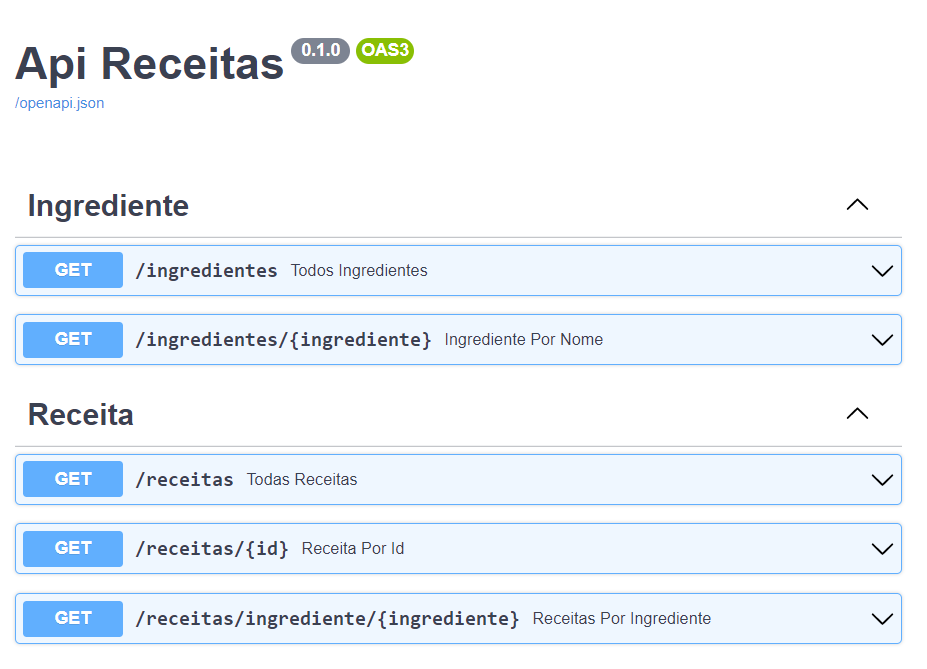

# Ideia
- Criar Api em Python usando FastAPI
- Swagger documentando os endpoints
- Endpoint GET recebe ingredientes e retorna lista de receitas

### Instalar todas as dependências
* python -m venv venv
* venv\Scripts\activate.bat
* pip install -r requirements.txt

## Configurar
* Estrutura em banco.sql
* Conexão em models/banco.py variavel SQLALCHEMY_DATABASE_URL

## Importar Json para banco de dados
> python services/importar_json.py
