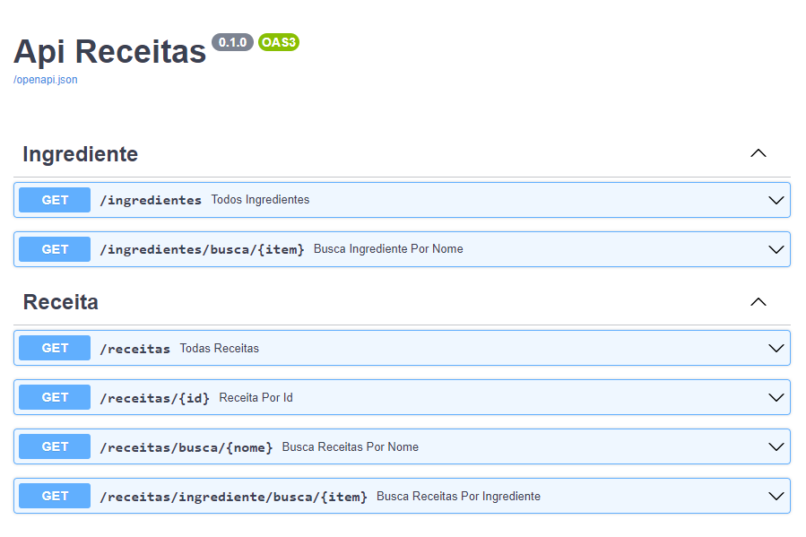

# Ideia
- Criar Api em Python usando FastAPI
- Swagger documentando os endpoints
- Endpoint GET recebe ingredientes e retorna lista de receitas

# A fazer
- Melhorar fluxo de importação para banco SQL

### Instalar todas as dependências
```bash
python -m venv venv
venv\Scripts\activate.bat
pip install -r requirements.txt
```

## Configurar
* Estrutura em static/banco.sql
* Conexão em .env variavel DATABASE_URL

## Importar Json para banco de dados
```bash
python importar_json.py
```

## Iniciar API
```bash
venv\Scripts\activate.bat
uvicorn api:app --reload
```

## Links
* [Api](http://localhost:8000/)
* [Doc](http://localhost:8000/docs#/)
